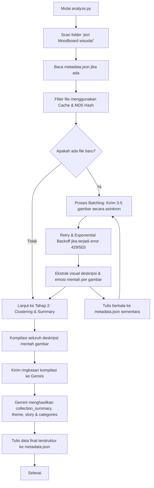

# MOODBOARD AI CURATOR — ARCHITECTURE & IMPLEMENTATION PLAN

## DISKUSI & TINJAUAN ARSITEKTUR

Dokumen ini berisi analisis arsitektur, rencana implementasi, serta keputusan desain untuk Moodboard AI Curator. Berdasarkan diskusi terbaru, seluruh dokumentasi dan penjelasan disajikan dalam Bahasa Indonesia.

---

### 1. Framework Decision Review (Evaluasi Pilihan Framework)

Kami membandingkan kembali penggunaan **Vanilla HTML/CSS/JS** dengan **React (Vite)** dari sudut pandang pemeliharaan (maintainability) jangka panjang dan kenyamanan pengembangan (Developer Experience - DX).

* **Dari Sisi Maintainability**:
  * **Vanilla JS**: Bebas dari pembaruan dependensi. Kode akan tetap berjalan selama browser web mendukung standar HTML5/ES6. Namun, jika UI bertambah kompleks dengan banyak interaksi dinamis, kode Vanilla cenderung menjadi berantakan (spaghetti code) akibat manipulasi DOM manual (`document.getElementById`, `innerHTML`, dll).
  * **React**: Memberikan struktur modular yang sangat terorganisir melalui komponen mandiri dengan siklus hidup terisolasi. Kelemahannya adalah ancaman *dependency rot*—di mana library atau build tool (Vite, Babel, React) menjadi usang dan tidak dapat dikompilasi di masa depan tanpa pembaruan konfigurasi yang melelahkan.

* **Dari Sisi Developer Experience (DX)**:
  * **React**: Mempermudah pengelolaan state (seperti filter aktif, input pencarian, status drawer detail) secara deklaratif. Fitur *Hot Module Replacement (HMR)* di Vite memberikan umpan balik instan saat mendesain UI. Struktur komponen JSX jauh lebih mudah dibaca daripada template string HTML di JavaScript.
  * **Vanilla JS**: Pengembang harus menulis kode manual untuk merender ulang UI setiap kali filter berubah (misal menghapus semua elemen anak grid, lalu membuat ulang elemen HTML baru lewat JavaScript). Tidak ada build tool bawaan, sehingga pengembang harus menyegarkan halaman secara manual.

* **Rekomendasi Akhir yang Direvisi**:
  Kami menyarankan untuk tetap menggunakan **Vanilla HTML/CSS/JS** jika tujuan utama Anda adalah aplikasi portabel yang tidak memerlukan perawatan dan dapat berjalan selamanya hanya dengan klik dua kali. Namun, kami akan mengemas kode JavaScript Vanilla ini dengan struktur modular yang bersih (menggunakan ES6 Modules dan pola rendering berbasis fungsi/state sederhana) untuk menyamai kerapian struktur komponen React tanpa beban dependensi eksternal.

---

### 2. Kualitas Kategorisasi AI & Moodboard-Level Analysis

Kami mengusulkan integrasi **Moodboard-Level Analysis** langsung ke dalam alur kategorisasi dua tahap (*two-pass categorization*):

* **Tahap 1: Analisis Gambar Individual (First Pass)**
  * Analyzer memproses setiap gambar secara asinkron untuk mengekstrak informasi detail: judul sementara, deskripsi visual, emosi, nada warna dominan, dan tag estetika mentah.
  * Hasil mentah disimpan sementara di memori dan cache lokal.

* **Tahap 2: Analisis Koleksi & Clustering Kategori (Second Pass)**
  * Analyzer mengompilasi seluruh deskripsi mentah dari Tahap 1 menjadi satu ringkasan tekstual yang ringkas.
  * Ringkasan kompilasi ini dikirim ke Gemini Pro atau Flash dengan prompt kuratorial terpusat.
  * Gemini diminta untuk menganalisis koleksi secara makro dan menghasilkan:
    1. `collection_summary`: Ringkasan kuratorial tentang keseluruhan suasana dan isi moodboard.
    2. `collection_theme`: Tema utama yang menyatukan seluruh gambar (misal: "Kehangatan nostalgia masa-masa akhir perkuliahan").
    3. `collection_story`: Narasi puitis menyeluruh yang menghubungkan gambar-gambar tersebut sebagai satu kesatuan cerita.
    4. `categories`: Daftar 5-8 kategori puitis yang disesuaikan secara harmonis beserta deskripsinya, lalu memetakan setiap ID gambar ke dalam kategori-kategori tersebut.
  * Seluruh informasi tingkat makro ini disimpan langsung di bagian akar (root) file `metadata.json`.

---

### 3. Struktur Metadata Final

Berikut adalah struktur skema data dalam `metadata.json` yang mendukung analisis tingkat gambar maupun tingkat koleksi:

```json
{
  "collection_summary": "Koleksi kurasi visual wisuda yang memadukan kehangatan kenangan kampus dan ketidakpastian masa depan.",
  "collection_theme": "Transisi Sinematik & Nostalgia Sore Hari",
  "collection_story": "Di antara sudut-sudut perpustakaan yang sunyi dan tawa hangat di bawah sinar matahari sore, lembaran ini adalah saksi akhir dari sebuah babak perjalanan...",
  "categories": [
    {
      "id": "bittersweet-farewell",
      "name": "Bittersweet Farewell",
      "description": "Momen-momen perpisahan yang manis namun menyedihkan di sudut-sudut kampus."
    }
  ],
  "images": [
    {
      "id": "hash_unique_id",
      "filename": "0d14798e92a1fb4b550de9a2c404d9bc.jpg",
      "title": "Roll Credit",
      "description": "Sebuah momen perpisahan yang terasa seperti frame terakhir dari film coming-of-age.",
      "category_id": "bittersweet-farewell",
      "tone": "Nostalgic & Warm",
      "dominant_colors": ["#1A1A1A", "#D9C5B2", "#8C7A6B"],
      "aesthetic_tags": ["cinematic", "grainy", "golden hour", "retro"],
      "sensory_details": {
        "visual_description": "Siluet dua mahasiswa berjalan menjauh saat matahari terbenam.",
        "implied_sound": "Gemeresik angin sore dan petikan gitar akustik yang lambat",
        "implied_season": "Akhir Musim Panas / Juni"
      },
      "story_prompt": "Bayangkan ini adalah kenangan terakhir sebelum semua orang berpencar ke kota masing-masing."
    }
  ]
}
```

---

### 4. Strategi Batching dan Retry Gemini secara Rinci

Mengingat limit API pada tier gratis Gemini (15 RPM - Requests Per Minute), kami menerapkan arsitektur pertahanan API berikut pada skrip `analyze.py`:

* **Strategi Batching**:
  * Gambar tidak dikirim secara bersamaan dalam volume besar untuk menghindari error `429 Too Many Requests`.
  * Kami menggunakan **Sequential Batching dengan Delay Adaptif**: Memproses gambar dalam grup kecil berisi 3-5 gambar secara paralel, kemudian memberikan waktu jeda (sleep) selama 10-12 detik sebelum batch berikutnya dimulai.
  * Kecepatan rata-rata dibatasi agar tidak melampaui 12 request per menit (memberikan margin aman 20% di bawah limit 15 RPM).

* **Strategi Retry & Exponential Backoff**:
  * Setiap request API dibungkus dalam blok try-except dengan decorator retry.
  * Jika API mengembalikan error transient (seperti rate limit 429 atau server overload 503):
    1. Percobaan pertama akan menunggu selama $2^1$ (2) detik sebelum mencoba kembali.
    2. Percobaan kedua menunggu $2^2$ (4) detik.
    3. Percobaan ketiga menunggu $2^3$ (8) detik, hingga batas maksimum 5 kali percobaan.
  * Jika kegagalan tetap terjadi setelah 5 kali percobaan, skrip akan menyimpan kemajuan (progress) yang sudah berhasil ke `metadata.json`, mencatat nama file yang gagal ke log, dan menghentikan eksekusi dengan aman agar tidak ada data analisis sebelumnya yang hilang.

* **Sistem Caching**:
  * Sebelum memproses gambar baru, skrip memverifikasi apakah nama file dan ukuran file (file hash/size) sudah terdaftar dalam `metadata.json`. Jika ada, gambar tersebut langsung dilewati (skipped). Ini mencegah biaya API berlebih jika eksekusi skrip terputus di tengah jalan dan harus dijalankan ulang.

---

### 5. Alur Kerja Lengkap Analyzer



---

### 6. Pengalaman Galeri (Gallery Experience)

Desain Gallery mengutamakan estetika editorial museum digital:

* **Tata Letak (Layout)**:
  * Kolom grid asimetris (Masonry layout) dengan *padding* longgar.
  * Skema warna monokrom (#FFFFFF, #F5F5F5, #111111).
  * Bagian atas menampilkan **Header Editorial**: Judul koleksi, diikuti dengan teks narasi makro (`collection_summary` & `collection_theme`) yang ditampilkan dengan ukuran font besar dan elegan.

* **Menampilkan Kategori**:
  * Disediakan bilah navigasi minimalis di bawah header utama untuk beralih antar pameran seni (kategori).
  * Efek transisi memudar halus (*opacity transition*) saat menyaring gambar.

* **Menampilkan Detail Gambar**:
  * Papan detail gambar meluncur masuk dari sisi kanan (Slide-out Drawer) tanpa memutus alur visual halaman utama.
  * Detail menyertakan warna dominan yang dirender sebagai palet warna kecil interaktif, deskripsi emosional, serta interpretasi sensorik suara/musim untuk memicu imajinasi.

---

### 7. Analisis Kinerja & Estimasi Biaya

Evaluasi untuk **93 gambar** saat ini dan ekspansi ke **300 gambar** di masa depan:

| Parameter | 93 Gambar (Koleksi Saat Ini) | 300 Gambar (Koleksi Masa Depan) |
| :--- | :--- | :--- |
| **Estimasi Waktu** | ~8 - 10 menit (karena pembatasan 12 RPM) | ~25 - 30 menit (karena pembatasan 12 RPM) |
| **Biaya API (Flash)** | ~$0.01 USD | ~$0.03 USD |
| **Pemuatan UI di Browser** | Instan (< 200ms untuk file JSON ~200KB) | Instan (< 300ms untuk file JSON ~600KB) |

---

## RENCANA IMPLEMENTASI ROADMAP

### Fase 1: Pembuatan Script Analyzer (`analyze.py`)
* Implementasi pemindaian direktori, hashing file untuk sistem caching tangguh.
* Penulisan fungsi API Gemini dengan strategi retry exponential backoff dan delay batching (12 RPM limit).
* Implementasi alur Two-Pass: Tahap deskripsi gambar mentah, dilanjutkan dengan penggabungan untuk analisis koleksi global dan kategorisasi koheren.

### Fase 2: Eksekusi Analisis Penuh
* Menjalankan analyzer untuk seluruh 93 gambar.
* Memastikan `metadata.json` terbentuk sempurna dengan data tingkat koleksi dan tingkat gambar.

### Fase 3: Pengembangan UI Galeri (`index.html`, `style.css`, `app.js`)
* Penyusunan struktur HTML5 semantik dan implementasi CSS Masonry Layout.
* Penerapan desain premium B&W.
* Integrasi teks tingkat koleksi (`collection_summary`, `collection_story`) di bagian atas galeri.
* Pengujian interaksi fungsionalitas filter, search, dan slide-out drawer detail gambar.
